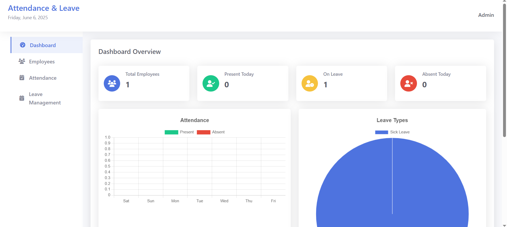
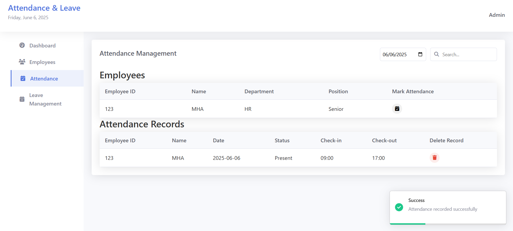
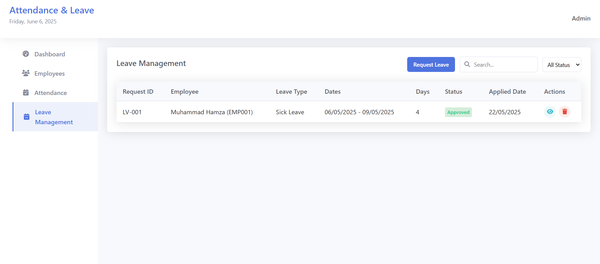

# Employee Attendance & Leave Management System



A modern web application built with Express.js and MongoDB for comprehensive employee attendance and leave management with data visualization capabilities.

## Features

- **Employee Management**: Add, view, and manage employee records
- **Attendance Tracking**: Record daily attendance status
- **Leave Management**: Submit and approve leave requests
- **Data Visualization**: Interactive charts and analytics
- **Responsive Design**: Works on all devices
- **RESTful API**: Clean backend architecture
- **MongoDB Integration**: Scalable data storage

## Technology Stack

- **Backend**: Node.js, Express.js
- **Database**: MongoDB
- **Frontend**: HTML5, CSS3, JavaScript
- **Data Visualization**: Chart.js
- **Package Manager**: npm

## Prerequisites

- Node.js (v14+)
- MongoDB (v4.4+)
- npm (v6+)

## Installation

1. Clone the repository:
   ```bash
   git clone https://github.com/yourusername/EmpAttendNLeave_Express.git
   cd EmpAttendNLeave_Express
   ```

2. Install dependencies:
   ```bash
   npm install
   ```

3. Set up environment variables:
   Create a `.env` file in the root directory with the following content:
   ```
   PORT=3000
   MONGODB_URI=mongodb://localhost:27017/attendance_db
   ```

4. Start MongoDB service:
   ```bash
   mongod
   ```

5. Run the application:
   ```bash
   npm start
   ```

6. Access the application at:
   ```
   http://localhost:3000
   ```

## Data Visualization

The dashboard includes the following charts powered by Chart.js:

1. **Attendance Overview**: Pie chart showing present/absent distribution
2. **Monthly Trends**: Line chart of attendance patterns
3. **Leave Breakdown**: Bar chart of leave types
4. **Department Analysis**: Comparative charts by department

## Customization

### Adding New Features
1. Create new model in `models/`
2. Add controller in `controllers/`
3. Define routes in `routes/`
4. Create frontend view in `public/`

### Changing Visual Style
- Modify `public/css/styles.css`
- Update Chart.js configurations in dashboard.js

## Troubleshooting

- **Connection refused to MongoDB**:
  - Verify MongoDB service is running
  - Check connection string in `.env`

- **CORS errors**:
  - Ensure frontend is making requests to correct origin
  - Verify proxy settings if using frontend frameworks

- **Chart not rendering**:
  - Check browser console for errors
  - Verify Chart.js is properly included

## Screenshots




